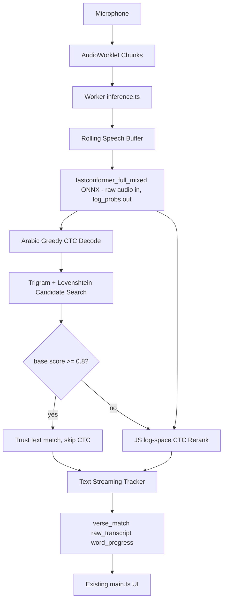

<!-- ec37a28f-4bad-48ac-b67f-fb41cc917789 -->
---
todos:
  - id: "assets-model"
    content: "Add Cyberistic public assets: fastconformer_full_mixed.onnx, vocab.json, tokenizer.model, quran_ctc_tokens.json, Git LFS rules, and text-CTC export_metadata."
    status: completed
  - id: "cache-metadata-polish"
    content: "Align model-cache key with export_metadata output_name and verify metadata/hash fields are internally consistent."
    status: pending
  - id: "decode-rerank"
    content: "Finish Arabic text CTC decode/rerank path: greedy decode exists; still need Quran asset adapter, candidate retrieval, and JS log-space CTC rerank constants/gates."
    status: in_progress
  - id: "stream-tracker"
    content: "Replace worker phoneme/mel/trie wiring with raw-audio ONNX inference plus a rolling-window text tracker that emits existing UI messages."
    status: pending
  - id: "types-ui-data"
    content: "Move frontend display data to quran.json, remove word_correction handling, and make remaining phoneme-prefixed fields legacy/internal adapter details only."
    status: pending
  - id: "drop-dead-phoneme-stack"
    content: "Delete or stop importing obsolete phoneme files/data after the text path compiles: mel.ts, beam-decode.ts, phoneme-trie.ts, correction.ts, quran_phonemes.json, phoneme_vocab.json, old CTC decoder usage."
    status: pending
  - id: "validate-docs"
    content: "Add targeted tests, run streaming stability checks, perform manual browser validation, and update experiment docs."
    status: pending
  - id: "demo-parity-check"
    content: "Subagent: after implementation, diff the running demo's decode→match→rerank path against Cyberistic's inference.worker.ts to confirm behavioral parity (constants, log-space CTC, text-first short-circuit, span keys)."
    status: pending
isProject: false
---
# Cyberistic Streaming Swap

## Target Shape

Keep the current browser streaming shell: microphone -> AudioWorklet chunks -> `web/frontend/src/worker/inference.ts` -> existing `WorkerOutbound` messages -> `web/frontend/src/main.ts`. Swap only the ASR/decode/match layer from phoneme tracking to Arabic text CTC.

Current worker is wired to the phoneme stack here:

```12:25:web/frontend/src/worker/inference.ts
const MODEL_URL = "/fastconformer_phoneme_q8.onnx";
const JOINT03_BEAM_WIDTH = 6;
const JOINT03_TOP_SYMBOLS = 8;
const JOINT03_MAX_HYPOTHESES = 4;
// ...
let tracker: RecitationTracker | null = null;
let decoder: CTCDecoder | null = null;
let db: QuranDB | null = null;
let trie: CompactTrie | null = null;
```

Replace that with `fastconformer_full_mixed.onnx`, `vocab.json`, `quran.json`, and `quran_ctc_tokens.json`.

## Progress Checkpoint — 2026-06-29

Current branch state after the first implementation pass:

- **Assets landed locally**: `web/frontend/public/fastconformer_full_mixed.onnx`, `vocab.json`, `tokenizer.model`, and `quran_ctc_tokens.json` are present. `.gitattributes` and `.gitignore` were moved from the old `fastconformer_phoneme_q8.onnx` exception to the new full mixed model.
- **Metadata mostly swapped**: `web/frontend/public/export_metadata.json` now describes the Cyberistic text-CTC model and rerank constants instead of the 70-token phoneme model.
- **Cache key partially swapped**: `web/frontend/src/worker/model-cache.ts` was moved off the old phoneme cache key, but still needs to be aligned with `export_metadata.output_name` (`fastconformer-full-mixed-text-ctc`) so cache invalidation is unambiguous.
- **Greedy text CTC decode started**: `web/frontend/src/worker/text-ctc-decode.ts` exists and can collapse log-prob IDs into normalized Arabic text using `vocab.json`, with SentencePiece `▁` word-boundary handling.
- **Hot path not wired yet**: `web/frontend/src/worker/inference.ts` still loads the old phoneme model/data and still imports `computeMelSpectrogram`, old `CTCDecoder`, trie beam search, and `RecitationTracker`.
- **Session still expects mels**: `web/frontend/src/worker/session.ts` still takes mel features; it has not been switched to raw `audio_signal` + `length` ONNX inputs.
- **UI/types still include phoneme correction**: `web/frontend/src/lib/types.ts`, `web/frontend/src/lib/tracker.ts`, and `web/frontend/src/main.ts` still include `WordCorrectionMessage` / `computeCorrection` / `handleWordCorrection` paths that should be removed for the text pipeline.

Remaining implementation should be ruthless about the user's cleanup direction: keep the UI contract that matters (`raw_transcript`, `verse_candidate`, `verse_match`, `word_progress`, `final_sequence`, diagnostics), but remove the phoneme/mel/trie/correction code once the text path owns the worker.



## Reference parity (verified against Cyberistic)

A subagent inspected `github.com/Cyberistic/offline-quran-validation`. Their repo is a superset of ours and **already ships a fully client-side browser port** (`web/frontend/src/worker/inference.worker.ts`). The facts below are confirmed against that source and the local Python blueprint in `experiments/c2c-direct/run.py`. This is the ground truth this plan ports.

- **Model**: `fastconformer_full_mixed.onnx`, CTC head of `nvidia/stt_ar_fastconformer_hybrid_large_pcd_v1.0`. Output is `log_probs` `[1, T, 1025]`, **already log-softmaxed** — do NOT apply another log-softmax in JS.
- **Vocab**: SentencePiece BPE, `VOCAB_SIZE = 1025`, `BLANK_ID = 1024`. Decode is id→string lookup + `▁`→space; no SentencePiece runs in the browser.
- **No JS tokenizer, by design**: text→ids is sidestepped entirely by shipping precomputed per-verse token IDs. `tokenizer.model` is shipped upstream but **unused at runtime** — do not wire SentencePiece into JS.
- **Audio preprocessing is baked into the ONNX graph** (custom real-STFT op in their `scripts/export_fastconformer_onnx.py`). The model takes RAW audio `audio_signal: float32[1, N]` + `length: int64[1]`. **Zero JS DSP** — no mel/STFT/librosa-in-WASM needed. If we ever re-export, we must preserve this STFT bake-in.
- **Selection is two-stage**: cheap trigram+Levenshtein text match first; only run CTC rerank when `base.score < FALLBACK_THRESHOLD (0.8)`. Clean audio never pays for CTC.
- **CTC rerank** is a hand-rolled log-space forward algorithm in vanilla JS (`logAddExp` recursion over the blank-interleaved target), normalized by target length (`-logLike / target.length`), with feasibility gate `target.length * 2 + 1 > T → skip`. `finalScore = -normLoss - SPAN_PENALTY * (ayah_end - ayah)`, `SPAN_PENALTY = 0.5`. Reported confidence for a CTC winner is `exp(-normLoss)`.
- **`quran_ctc_tokens.json`**: keyed `"surah:ayah:ayah_end"` → token-id array. Upstream has **35,717 keys (29,481 multi-ayah spans)**, ~12 MB. Spans are `" ".join(verse text_clean)` tokenized **once** as concatenated text, not concatenated IDs.
- **No in-repo generator** for `quran_ctc_tokens.json` — it's a committed build artifact upstream. We must write our own generator (one piece of glue they didn't commit).
- **Their browser demo does NOT stream**: live mode rebuilds a Blob from all accumulated MediaRecorder chunks every 2s and re-decodes the whole clip from scratch (O(n²) as the clip grows). There is **no client-side verse tracker**. Our rolling-window streaming tracker is genuinely additive, not a reinvention — this is the main thing we add on top.

## Implementation Plan

1. Add Cyberistic model/runtime artifacts.

- Put `fastconformer_full_mixed.onnx` under `web/frontend/public/` and track it via Git LFS.
- Update `.gitignore` to allow the new ONNX, similar to the existing exception for `fastconformer_phoneme_q8.onnx`.
- Update `web/frontend/src/worker/model-cache.ts` `MODEL_KEY` from `fastconformer-phoneme-ctc-v1` to a new key like `fastconformer-full-mixed-ctc-v1`, so browsers do not reuse the old cached model.
- Rewrite `web/frontend/public/export_metadata.json` to describe the new model. The current file describes the phoneme model (70-token phoneme vocab, `fastconformer_phoneme_q8.onnx`); replace its `vocab_tokens`/`vocab_sha256`/sizes with the BPE-CTC model's values and add a `vocab_hash` (see step 2).

2. Load/adapt `quran_ctc_tokens.json`.

`web/frontend/public/vocab.json`, `web/frontend/public/quran.json`, and `web/frontend/public/quran_ctc_tokens.json` are now present locally. The immediate remaining work is an adapter that merges `quran.json` display text with precomputed CTC IDs from `quran_ctc_tokens.json` and feeds the matcher/tracker with text-token fields.

If we want reproducibility beyond the copied upstream artifact, add a one-off Python script later (e.g. `scripts/build_ctc_tokens.py`) that:

- Loads the SentencePiece tokenizer that produced `fastconformer_full_mixed.onnx` (NeMo `tokenizer.text_to_ids`, matching `experiments/c2c-direct/run.py`).
- For every single verse and every valid multi-ayah span, builds the candidate text as `" ".join([v.text_clean ...])` (normalized clean Arabic, NOT Uthmani), tokenizes **once**, and writes `"surah:ayah:ayah_end" -> [ids]`. Single verses use `ayah == ayah_end`.
- Emits a top-level `vocab_hash` (sha256 of `vocab.json` contents) into both this file and `export_metadata.json`, so the worker can refuse to run if the loaded vocab and token table disagree.
- Match upstream's span cap: generate single verses plus multi-ayah spans up to **max span length 5** (`ayah_end - ayah <= 4`), which yields ~29k spans / ~12 MB. Do not generate the full 6236-choose-span combinatorial set; longer spans fail the `2L+1<=T` gate at runtime anyway. Verify the resulting key count (~35,717) and file size (~12 MB) land in the upstream ballpark; if the count is off by more than ~10%, adjust the max span length and re-check rather than shipping a divergent table.

Immediate adapter requirements:

- Preserve existing `QuranDB`/tracker expectations by filling `phoneme_token_ids`, `phonemes_joined`, `phoneme_words`, and `word_token_ends` with text-CTC token data for now.
- Normalize Arabic through the same `normalizeArabic` path as decoded transcripts.
- Use SentencePiece `▁` boundaries from `vocab.json` to derive word boundaries; do not run SentencePiece in JS.
- Strip or align Bismillah prefixes consistently between `quran.json` display text and tokenized clean text.
- Sanity check a handful of `surah:ayah:ayah_end` keys by decoding stored IDs through `vocab.json` and comparing to normalized clean text.

3. Port text decode and rerank modules.

Add worker-side modules modeled on Cyberistic's `inference.worker.ts` and the local Python blueprint in `experiments/c2c-direct/run.py`:

- `web/frontend/src/worker/text-ctc-decode.ts`: greedy CTC collapse from `[T,V]` **log-probs** (already log-softmaxed — no extra log-softmax) to Arabic token IDs, then `vocab[id]` join + `▁`→space + `normalizeArabic`. This file exists; keep extending it rather than adding another duplicate greedy decoder.
- `web/frontend/src/worker/rerank-candidates.ts`: log-space forward-algorithm CTC loss in vanilla JS over the blank-interleaved target, normalized by target length, with the mandatory `target.length * 2 + 1 > T → skip` gate. `finalScore = -normLoss - 0.5 * (ayah_end - ayah)`; report `exp(-normLoss)` as confidence.
- `web/frontend/src/worker/text-candidates.ts`: trigram-indexed shortlist + Levenshtein `ratio` scoring, current-verse hint, and multi-ayah spans built as concatenated `text_clean`.
- Wire the two-stage selection: compute `base` text match; `useCtc = !base || base.score < 0.8`; only then rerank.

The Python behavior to port is the candidate and rerank flow:

```251:314:experiments/c2c-direct/run.py
def _build_candidates(transcript: str) -> tuple[list[dict], dict | None]:
    """Three retrieval strategies + multi-ayah spans."""
    out: list[dict] = []
    seen: set = set()
    single_refs: list[tuple[int, int]] = []
    # ... text search, spaceless scan, multi-ayah spans ...


def _ctc_rerank(log_probs_np: np.ndarray, candidates: list[dict]) -> list[dict]:
    """Batched F.ctc_loss against FastConformer's own [T, 1025] log-probs.
```

4. Replace phoneme `RecitationTracker` with a rolling-window text streaming tracker (the additive layer).

Add `web/frontend/src/lib/text-streaming-tracker.ts` (or keep it worker-local if it needs no DOM/shared state). Unlike Cyberistic's client (which has no tracker and brute-force re-decodes the whole buffer every 2s), this maintains a real rolling window. Responsibilities:

- Maintain rolling audio since speech start, capped to a practical window such as 8-12 seconds.
- Run inference on a schedule, not every chunk, e.g. every 500-900 ms once speech energy is detected.
- Decode greedy transcript and emit `raw_transcript` immediately.
- Search and rerank candidate verses via the two-stage path above.
- Stabilize verse changes with confidence, margin, and continuity gates so the UI updates quickly but does not flicker.
- Carry a current `(surah, ayah)` hint so nearby verses and continuation spans are preferred after first lock.
- Emit the same UI message types currently consumed by `main.ts`: `verse_candidate`, `verse_match`, `word_progress`, `final_sequence`, and diagnostics.

5. Rewrite `web/frontend/src/worker/inference.ts` around the new tracker.

Remove phoneme imports and setup:

```5:8:web/frontend/src/worker/inference.ts
import { beamSearchDecode } from "./beam-decode";
import { buildTrie, type CompactTrie } from "../lib/phoneme-trie";
import { QuranDB } from "../lib/quran-db";
import { RecitationTracker } from "../lib/tracker";
```

Then load:

- `/vocab.json`
- `/quran.json`
- `/quran_ctc_tokens.json`
- `/fastconformer_full_mixed.onnx`

On load, assert `quran_ctc_tokens.json.vocab_hash === export_metadata.json.vocab_hash === sha256(vocab.json)`; refuse to run on mismatch (prevents garbage CTC scores from a model/vocab/token mispairing).

ONNX session: `onnxruntime-web/wasm`, `executionProviders: ["wasm"]`, `wasm.simd = true`, `numThreads = min(4, hardwareConcurrency)`. Inputs are `audio_signal: float32[1, N]` and `length: int64[1]` (raw audio — STFT is in the graph). Output `log_probs`.

The worker's `audio` handler should still be shaped like today so the UI pattern stays intact:

```346:351:web/frontend/src/worker/inference.ts
  } else if (msg.type === "audio") {
    if (!tracker) return;
    const messages = await tracker.feed(msg.samples);
    for (const m of messages) {
      post(m);
```

Only the `tracker.feed()` implementation changes.

6. Split Quran data from phoneme data in shared frontend types.

Update `web/frontend/src/lib/types.ts` so `QuranVerse` has plain Quran fields (`text_uthmani`, `text_clean`, surah metadata) as first-class fields and phoneme fields become optional or move to a legacy type. Update `web/frontend/src/main.ts` to fetch `/quran.json` instead of `/quran_phonemes.json`:

```113:117:web/frontend/src/main.ts
async function loadQuranData(): Promise<void> {
  if (state.quranData) return;
  const res = await fetch("/quran_phonemes.json");
  state.quranData = await res.json();
  initSurahDropdown(state.quranData);
```

This is enough for display, because the UI only needs surah metadata and `text_uthmani`.

7. Preserve real-time word highlighting without phonemes.

Implement `word_progress` by text alignment against the active verse's normalized Arabic words. Less acoustically precise than phoneme-token alignment, but keeps the interaction pattern: once a verse is locked, the highlighted word advances as the transcript prefix grows. Use Uthmani text for display and normalized `text_clean` for matching. **Add a monotonic guard**: within a locked verse the emitted word index must never decrease, even if a later (longer) decode briefly aligns shorter — prevents highlight flicker.

8. Drop the old phoneme stack once the text path compiles.

The implementation direction is cleanup-first, not compatibility layering. Stop importing the old stack from the hot path as soon as the text worker is wired:

- Remove `computeMelSpectrogram` from worker inference; the Cyberistic ONNX takes raw waveform.
- Remove `beamSearchDecode` and `phoneme-trie` from worker inference; text candidate search + optional CTC rerank replaces them.
- Remove `computeCorrection`, `WordCorrectionMessage`, and UI `handleWordCorrection`; word progress is text-aligned instead.
- Delete old public phoneme data (`quran_phonemes.json`, `phoneme_vocab.json`) once `main.ts` displays from `quran.json`.
- Keep a file only if tests or a benchmark still import it deliberately; otherwise delete it instead of leaving dead code.

## Validation Plan

- Add deterministic unit tests for:
  - greedy decode (log-probs in → known token ids/text out, no double log-softmax),
  - Arabic normalization parity (transcript path vs. DB path produce identical normalization for the same input),
  - CTC rerank ordering (a fixed `[T,1025]` log-prob matrix + 2-3 candidates ranks the correct one first; verify the `2L+1>T` skip),
  - candidate span generation (`"s:a:b"` keys, concatenated `text_clean`),
  - tracker stabilization (no verse flicker; `word_progress` monotonic guard holds).
- Run `cd web/frontend && npx vitest run`.
- Run streaming stability tests with 3 repeats on both corpora:
  - `npx tsx test/stability-report.ts --repeats=3 --json=test/cyberistic-full-mixed-v1-stability.json`
  - `npx tsx test/stability-report.ts --repeats=3 --corpus=test_corpus_v2 --json=test/cyberistic-full-mixed-v2-stability.json`
- Baseline expectation: this ports the `c2c-direct-mixed` champion (EXPERIMENTS.md: ~98% batch accuracy, ~0.72s). **TTA is intentionally dropped** (the `-tta` variant hits 100% but adds latency unacceptable for streaming) — expect the ~98% tier, not 100%. State this in the changelog rather than chasing the TTA number.
- Manually test the web demo: load, click Start, speak, verify transcript appears immediately, verse candidate locks quickly, active verse updates, and word progress advances without requiring Stop.
- Compare a few samples against `https://quran-ml.sudokw.com/` for sanity, but treat local stability reports as the source of truth.
- Document the shipped-pipeline change in `EXPERIMENTS.md`, and update `README.md` only if the headline shipped metric changes.

## Post-implementation demo parity check (subagent)

After the pipeline runs end-to-end in the browser, dispatch a subagent to confirm the demo's behavior actually matches Cyberistic's `offline-quran-validation` approach (not just "looks like it works"). The subagent should:

- Clone/read `github.com/Cyberistic/offline-quran-validation` `web/frontend/src/worker/inference.worker.ts` and diff its decode→retrieve→rerank→select path against our new `decode-greedy.ts` / `text-candidates.ts` / `rerank-candidates.ts`.
- Verify the ported constants and structure match: `BLANK_ID = 1024`, `FALLBACK_THRESHOLD = 0.8`, `SPAN_PENALTY = 0.5`, log-space CTC forward with the `2L+1<=T` gate, length-normalized loss, `exp(-normLoss)` confidence, text-first short-circuit, `"surah:ayah:ayah_end"` span keys, raw-audio ONNX input (no JS mel/STFT), no extra log-softmax.
- Flag any divergence as either an intentional improvement (our streaming tracker, which they lack) or a bug to fix. Report a structured pass/fail per checklist item.

## Main Risks

- `quran_ctc_tokens.json` must use exactly the same tokenization/vocab as the ONNX output. If it does not, CTC rerank scores are garbage even when the greedy transcript looks plausible. The `vocab_hash` guard (step 2/5) is the mitigation; do not skip it.
- We must build the token-table generator ourselves — Cyberistic ships the artifact but not the script. A subtle mismatch (Uthmani vs. clean text, wrong normalization, wrong span concatenation) silently corrupts rerank. Round-trip-test the generator.
- Cyberistic's client is batch-on-accumulated-audio, not streaming. Our rolling-window tracker is new code with no upstream reference to copy — it carries the most behavioral risk and needs the heaviest stability testing.
- CTC rerank in JS can get expensive. Keep the shortlist small, honor the text-first short-circuit (`< 0.8` only), enforce the `2L+1>T` skip, and run rerank only after there is enough speech.
- Word progress is text-aligned, not phoneme-aligned. Good enough for UI movement, but not as exact as the current phoneme tracker; the monotonic guard prevents the worst flicker.
